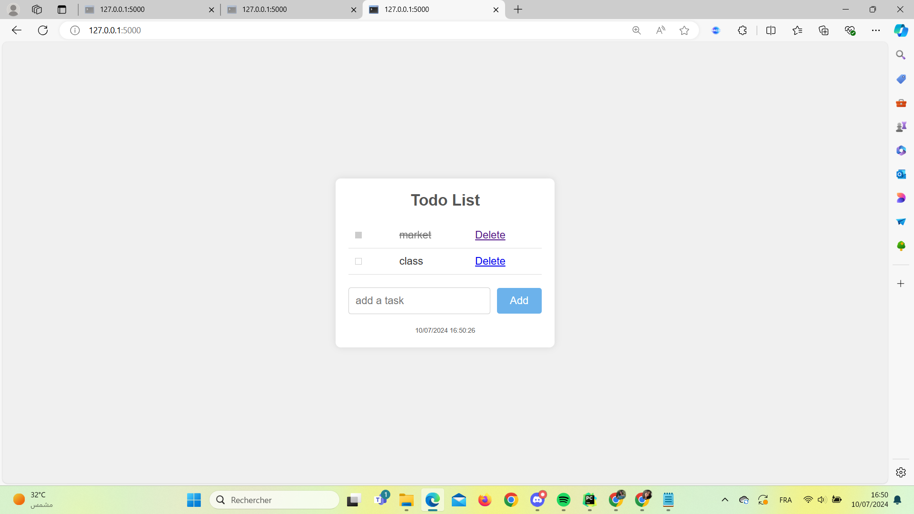

# Todo List Application

A simple Todo List application built with Flask.

## Table of Contents

- [Installation](#installation)
- [Usage](#usage)
- [Features](#features)
- [Contributing](#contributing)
- [License](#license)

## Installation

### Prerequisites

Make sure you have the following installed:

- Python 3.x
- Flask

### Steps

1. Clone the repository:

```sh
git clone https://github.com/yourusername/todo-list.git
cd todo-list
2.Create a virtual environment:
python -m venv .venv
3. Activate the virtual environment:
On Windows:
.venv\Scripts\activate
4.Install the dependencies:
pip install -r requirements.txt
5.Set up the database:
flask db init
flask db migrate -m "Initial migration."
flask db upgrade
6.Run the application:
flask run



